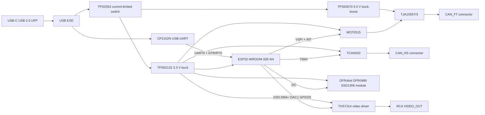

# Architecture

## Proposed system

## Functional boundaries

- `CAN_HS` uses only the ESP32 TWAI controller and TCAN332 physical layer.
- `CAN_FT` uses MCP2515 over SPI and TJA1055T/3. It shares no controller signals
  with `CAN_HS`.
- The OLED and composite video are independent displays.
- USB-C is a 5 V sink/UFP with no Power Delivery. CP2102N supplies programming
  and UART debug; it does not power the board through its internal regulator.
- `+3V3` powers logic. `+5V_FT` exists because TJA1055T/3 requires 4.75–5.25 V
  at VCC and at least 5.0 V at BAT in operation. Raw USB VBUS cannot guarantee
  those limits after protection losses.

## Voltage domains

| Domain | Source | Loads | Design status |
|---|---|---|---|
| `VBUS_USB` | USB-C, nominal 5 V | USB ESD and CP2102N VBUS sense | Connector-side, unprotected |
| `+5V_USB_PROT` | TPS2553 output | DC/DC inputs, test point | Current limited and reverse-voltage protected |
| `+3V3` | TPS62132 fixed 3.3 V buck | ESP32, TCAN332, MCP2515, OLED, CP2102N logic, THS7314 | 3 A regulator; estimated peak load below 0.7 A |
| `+5V_FT` | TPS63070 adjusted to 5.0 V | TJA1055 VCC and BAT only | Regulated across USB tolerance; keep converter away from video |
| `VIDEO_OUT` | THS7314 through 75 ohm | RCA center conductor / external 75 ohm input | Analog; 1 Vpp target at load |
| GND | USB ground / board plane | All domains, RCA shell, CAN connector grounds | One board ground; no default video isolation |

## PCB strategy for Phase 2

Use four layers: L1 components/signals, L2 unbroken GND, L3 power and slow
signals, L4 signals/components. Put the ESP32 antenna at a board edge and copy
the keepout dimensions from the selected module datasheet into courtyard/rule
areas. Put USB-C and CP2102N together; CAN protection at the CAN connectors;
both power converters in a compact power zone; and THS7314/RCA in a quiet zone
with no switch nodes beneath or alongside the video path. Route USB D+/D- as a
controlled, length-matched pair over continuous ground. Route each CAN pair
together over continuous return. Never autoroute the board.

## References

- Espressif ESP32-WROOM-32E/32UE datasheet v2.1: https://documentation.espressif.com/esp32-wroom-32e_esp32-wroom-32ue_datasheet_en.html
- Espressif hardware checklist: https://docs.espressif.com/projects/esp-hardware-design-guidelines/en/latest/esp32/schematic-checklist.html
- NXP TJA1055 datasheet: https://www.nxp.com/docs/en/data-sheet/TJA1055.pdf
