# Revision A rendered views

This page is the quick visual index for the current Revision A design. The
assets below were regenerated from the KiCad 10.0.6 source files on
2026-10-05. They are review material, not a substitute for the controlled
Gerber, drill, BOM, and placement files used for fabrication.

## PCB

[Open full-resolution top render](../manufacturing/generated/rev-a-audit/mechanical/board-top.png) ·
[bottom render](../manufacturing/generated/rev-a-audit/mechanical/board-bottom.png) ·
[top assembly PDF](../manufacturing/generated/rev-a-audit/mechanical/assembly-top.pdf) ·
[STEP model](../manufacturing/generated/rev-a-audit/mechanical/dual_can_esp32.step)

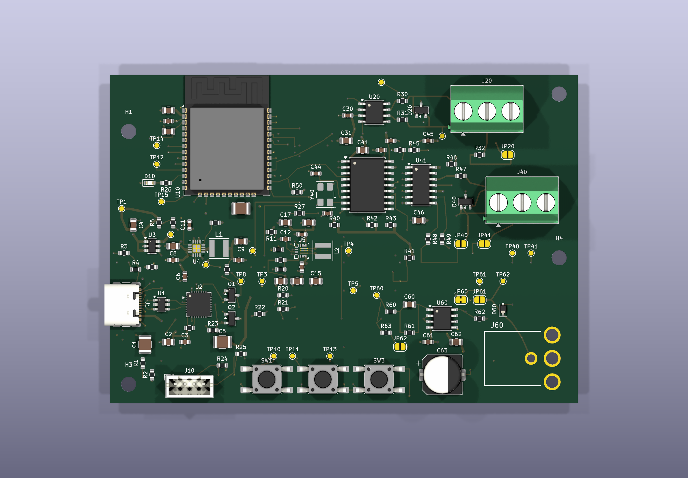

### Top assembly drawing

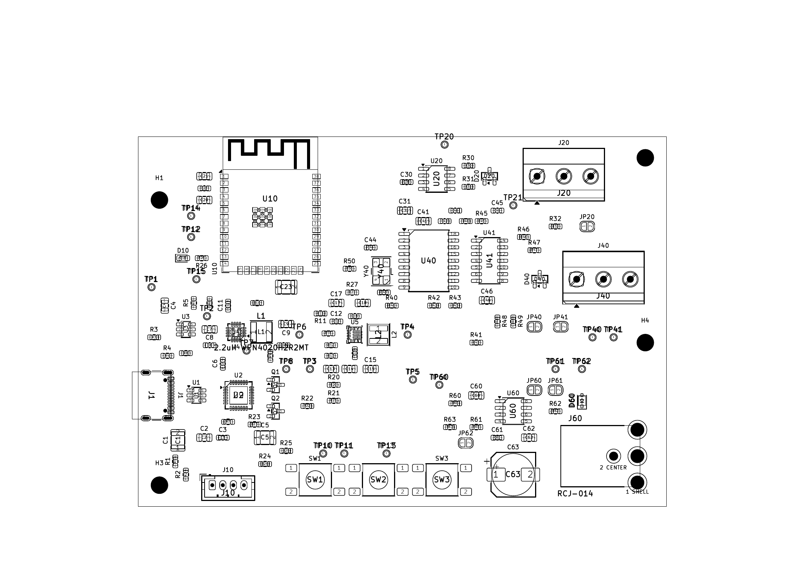

### Bottom render

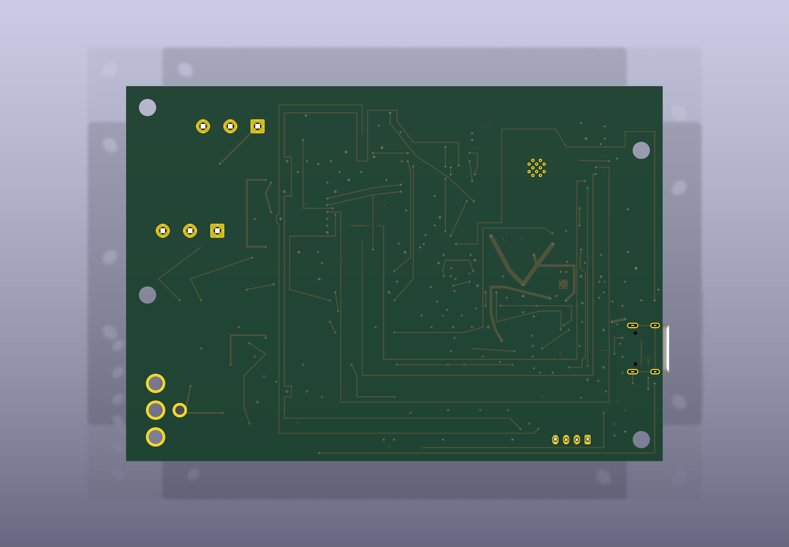

## Schematic

[Open the complete six-page schematic PDF](../manufacturing/generated/rev-a-audit/review/dual_can_esp32-schematic.pdf)

Individual schematic sheets are also available as SVG and PNG files in
[`review/schematic/`](../manufacturing/generated/rev-a-audit/review/schematic/).

| Overview | USB + power |
| --- | --- |
| [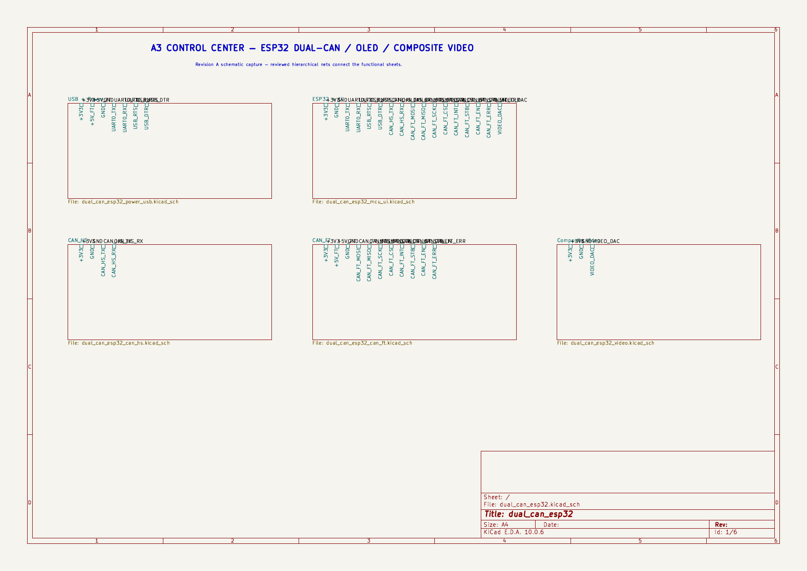](../manufacturing/generated/rev-a-audit/review/schematic/page-1.png) | [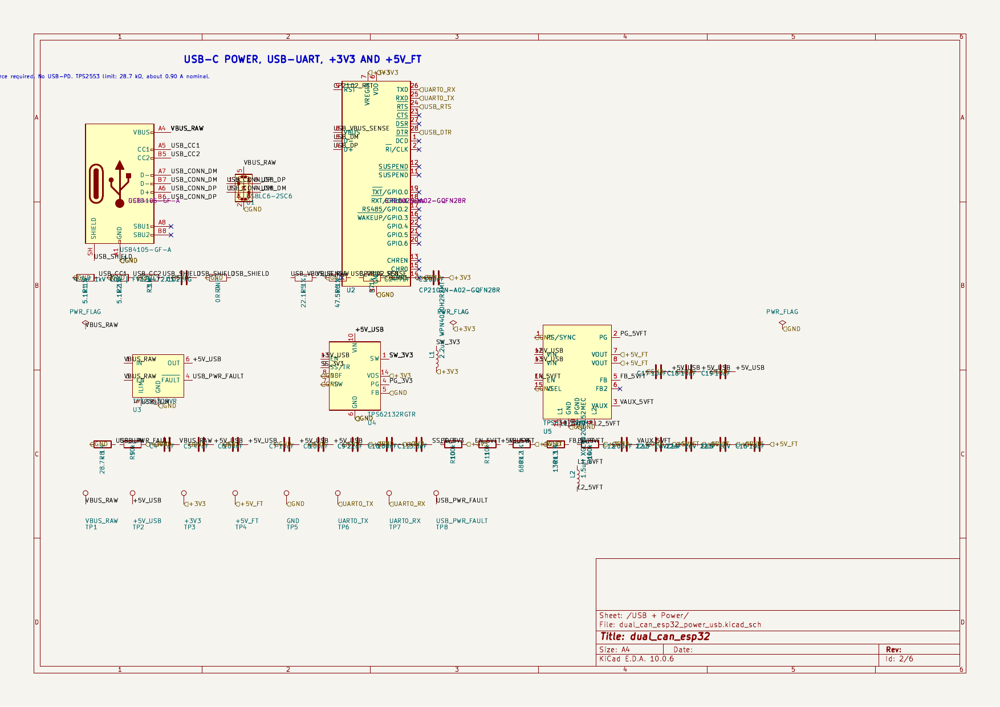](../manufacturing/generated/rev-a-audit/review/schematic/page-2.png) |
| ESP32 + UI | High-speed CAN |
| [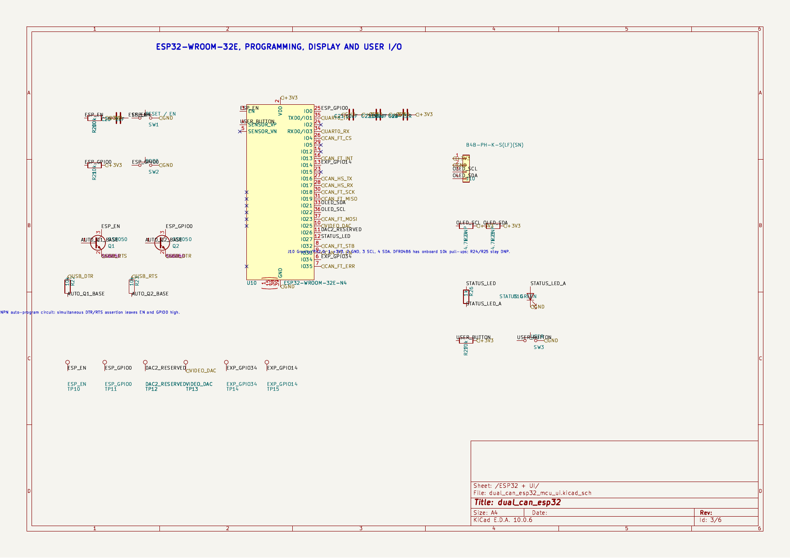](../manufacturing/generated/rev-a-audit/review/schematic/page-3.png) | [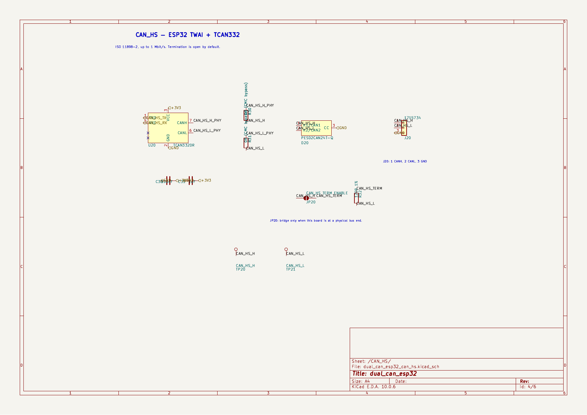](../manufacturing/generated/rev-a-audit/review/schematic/page-4.png) |
| Fault-tolerant CAN | Composite video |
| [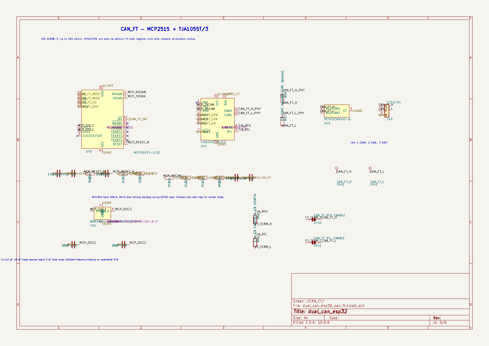](../manufacturing/generated/rev-a-audit/review/schematic/page-5.png) | [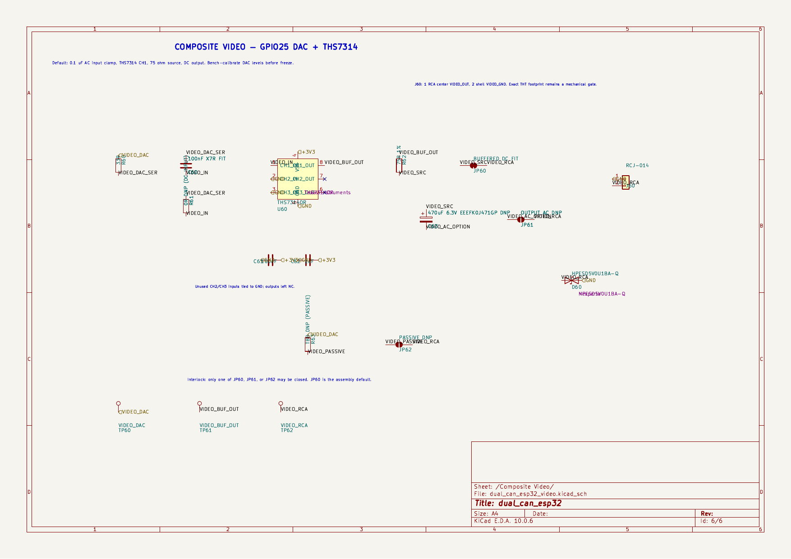](../manufacturing/generated/rev-a-audit/review/schematic/page-6.png) |

## Fabrication-layer review

[Open all rendered fabrication layers](../manufacturing/generated/rev-a-audit/review/)

### Front copper and drills

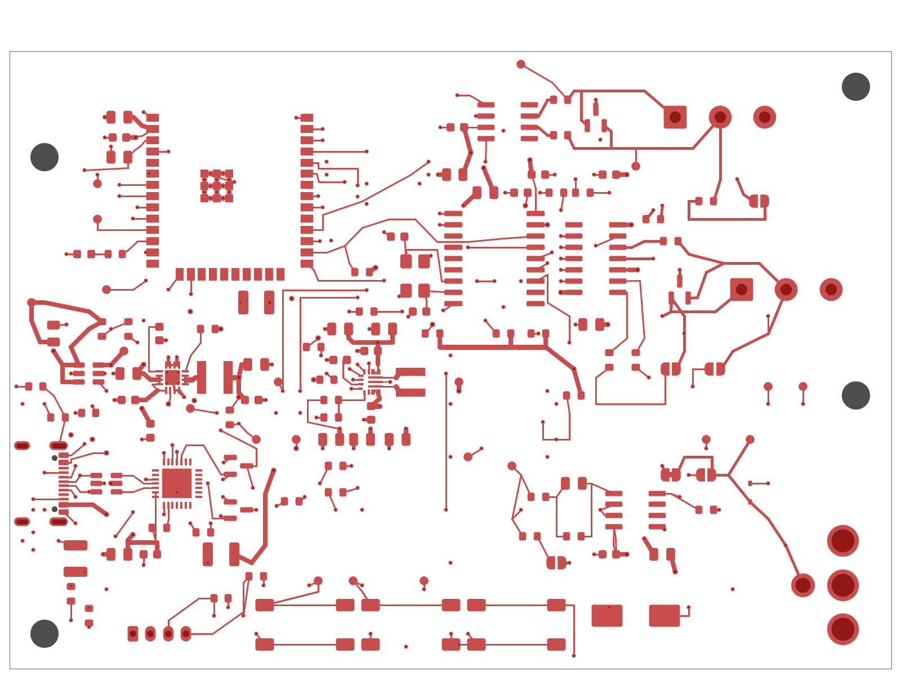

### Inner ground plane

### Inner power/signals

### Back copper and drills

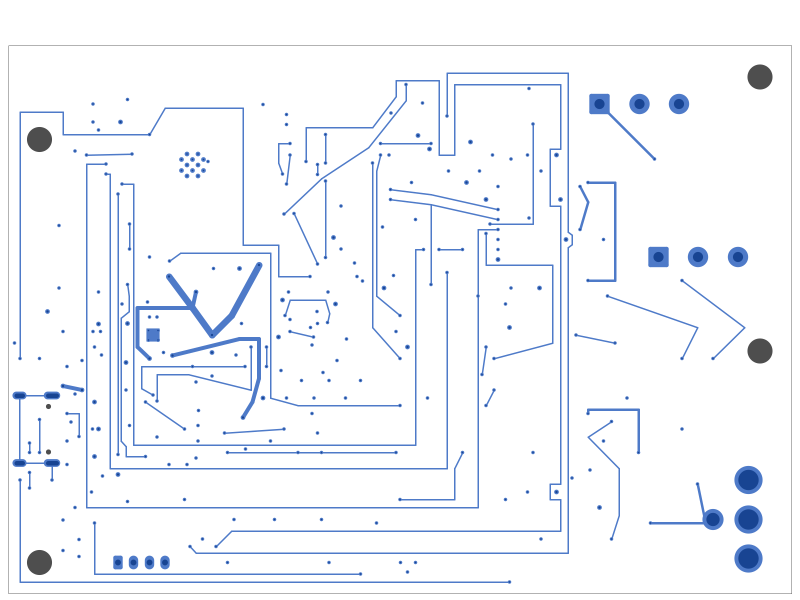

## Mechanical checks

- [Connector-fit drawing, print at Actual size / 100%](../manufacturing/generated/rev-a-audit/mechanical/connector-fit-1to1.pdf)
- [Board STEP model](../manufacturing/generated/rev-a-audit/mechanical/dual_can_esp32.step)
- Nominal PCB outline: 100 mm × 70 mm, four layers
